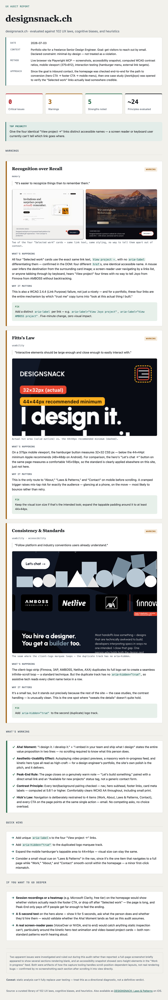

# ux-audit — Claude Code Skill

A Claude Code skill that audits any website, app, or UI against a bundled library of **102 UX laws, cognitive biases, and heuristics**.

Point it at a URL, a screenshot, or a codebase and get a prioritized, citable audit report in seconds.

Built on the same 102-principle library as my iOS app, [DESIGNSNACK: Laws & Patterns](https://apps.apple.com/us/app/designsnack-laws-patterns/id6754067995) — flashcards and AI quizzes if you'd rather study the principles than audit against them.

---

## Example output

A visual HTML report generated by the skill — scorecard, severity-coded findings with annotated screenshots, and a strengths/quick-wins summary:



---

## Installation

Requires Node.js 18+.

```bash
git clone https://github.com/thomasveit89/ux-audit-skill.git
cd ux-audit-skill
node scripts/install.mjs
```

That's it. The skill is now available in every Claude Code session.

### Optional: live-browser audits via Playwright MCP

By default, URL audits are done via a text fetch of the page — good for structure and copy, but blind to actual rendering (real contrast, real default vs. interacted states, mobile layout).

Installing the [Playwright MCP server](https://playwright.dev/docs/getting-started-mcp) lets the skill drive a real browser instead: it takes actual screenshots, reads the accessibility tree, clicks into accordions/modals to see their real states, computes actual contrast ratios, and can check mobile viewports. Recommended, not required — the skill detects it automatically and falls back to the text fetch if it isn't installed.

```bash
claude mcp add playwright npx @playwright/mcp@latest
```

Note: the first time it runs, Playwright downloads a Chromium binary (~150MB) to a global cache on your machine — a one-time cost shared across every tool that uses Playwright, not something this repo installs or manages.

### Optional: visual HTML reports

When Playwright MCP is available, you can also ask for a visual report instead of (or alongside) the markdown one. It's a shareable page with a scorecard up top, and each critical/warning finding backed by an actual annotated screenshot of your product — a highlighted box drawn on the real rendered page showing exactly where the issue lives, not just a text description of it. Published via Claude Code's Artifact feature, so you get a link you can share with your team.

Just ask, after any Playwright-based audit: "give me a visual version" / "make this an HTML report."

---

## Usage

In any Claude Code session:

```
/ux-audit https://yoursite.com
/ux-audit path/to/screenshot.png
/ux-audit app/components/HomePage.tsx
```

Or just describe what you want audited — the skill auto-triggers on:
- "audit my UI"
- "UX review"
- "check my design"
- "am I violating any UX laws?"

---

## What gets evaluated

102 principles across 6 categories:

| Category | What it covers |
|---|---|
| **attention** | How you direct and sustain user focus |
| **decisions** | How you support (or hinder) decision-making |
| **memory** | How much you ask users to remember |
| **persuasion** | Trust signals, social proof, motivation |
| **usability** | Core interaction quality |
| **visual** | Layout, hierarchy, Gestalt principles |

The principles include named laws (Fitts's Law, Hick's Law, Miller's Rule, Jakob's Law…), cognitive biases (Anchoring, Loss Aversion, Social Proof…), and Nielsen heuristics, each with concrete `do`/`dont` guidance.

---

## How it works

1. The skill reads `principles.json` (bundled, 102 principles)
2. Fetches and analyzes the target — via a live browser through Playwright MCP if installed, otherwise `WebFetch` — or reads provided files/screenshots
3. Evaluates the UI against each contextually relevant principle
4. Returns a structured markdown report with severity ratings and named citations — or, on request, a visual HTML report with annotated screenshots per finding (requires Playwright MCP)

The principles file is bundled so the core skill works fully offline — no external API calls. (The optional Playwright enhancement needs network access to fetch pages and, on first run, download a browser binary.)

---

## Roadmap

- [x] Playwright MCP integration — live-browser screenshots, accessibility snapshots, and real contrast checks (optional, see Installation)
- [x] HTML report output — shareable visual report with annotated screenshots per finding (optional, see Installation)
- [ ] Multi-page audit — crawl and audit full user flows, not just single pages
- [ ] Severity scoring — numerical score per category and overall

---

## Data source

`principles.json` is a curated, bundled library of UX laws, cognitive biases, and design heuristics — the same one behind [DESIGNSNACK: Laws & Patterns](https://apps.apple.com/us/app/designsnack-laws-patterns/id6754067995) on iOS. Pull requests adding or refining principles are welcome.

---

## License

MIT — see [LICENSE](LICENSE).
